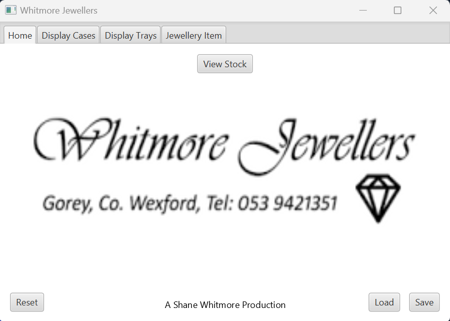
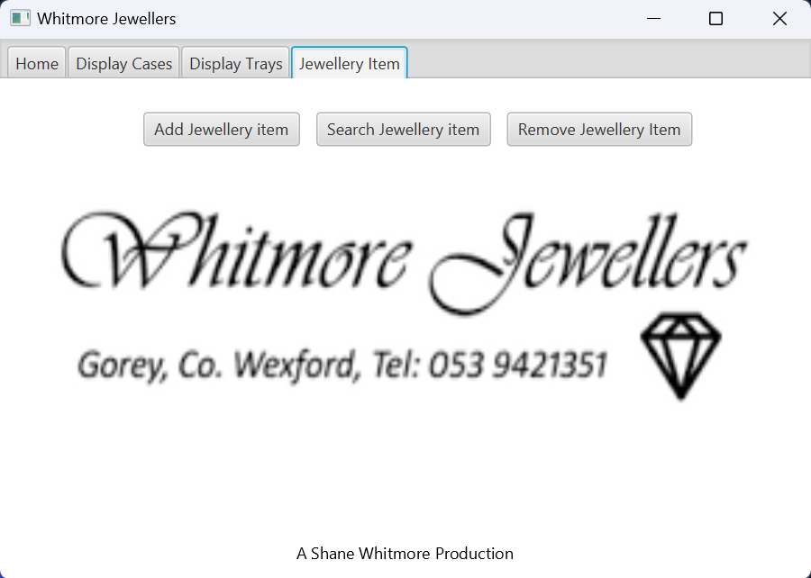
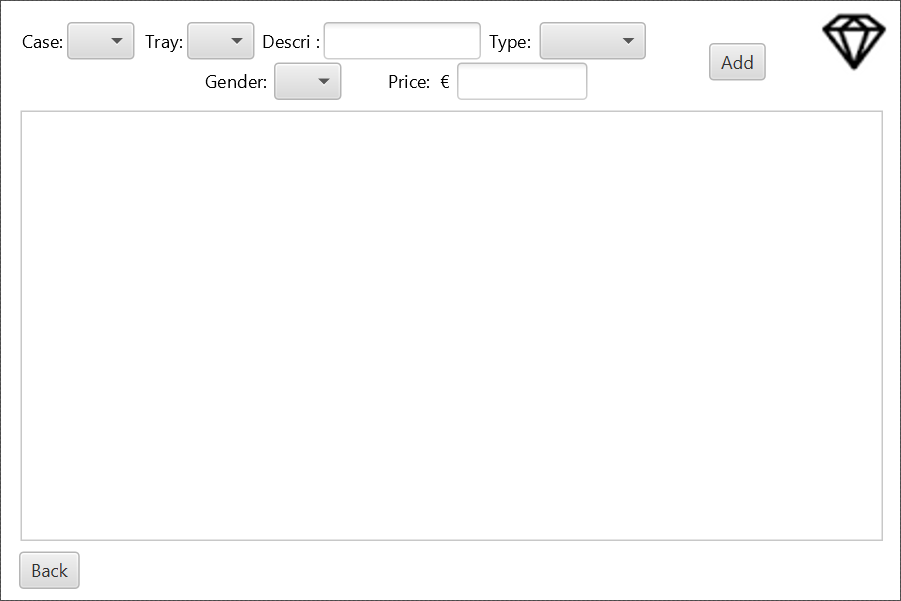

 <h1>Jewellery-Managment-System</h1>
 

  This program allows the user to keep track of jewellery store inventory. Key features of the program inlcude: total inventory value, Cabinet & Shelf ID's & the ability to accessorise shelves and cabinets.I used SceneBuilder to design the interface & the program was written in Intellij. The application uses a linked list to connect jewellery items, to a display tray which is connected to a display case.
 

 

  The application has a basic CRUD system to manage the jewellery inventory. To start adding Jewellery items, A case must first be added followed by a tray. The case can be customised from free-standing to wall-mounted and if it is lit or unlit. Similarly, the trays can also be customised.  
 

  
 

  

   
  

   A number of buttons are present on the 'Home' page. These include: a view stock button, a reset button (clears the objects from the linked list), a save button (saves the linked list to an xml file) and a load button (loads the last linked list back in to the program stored in an xml file). At the top of the page, there are many tabs to choose from. These tabs represent the cases, trays and items and each have there own seperate functionality.
  

   

  

 

 On the jewellery item page, the three options to choose from are the 'Add Jewellery Item', this allows you to add and item to a specific tray in a specific display case (interface seen below).
 The 'Search Jewellery Item' allows you to search for all items based on the item type (Watch, ring, necklace e.t.c.) and will display the location (case and tray) of the items.

 

  

 

 In the "Add Item" menu, a number of drop downs are displayed. These drop downs are only populated once a display case and a tray has been created. The display tray drop down will display all available trays in the display case that was selected in the previous drop down.

 The inventory value can be displayed on the main page. This uses nested loops to traverse through the inventory and calculate the total value of the inventory.

